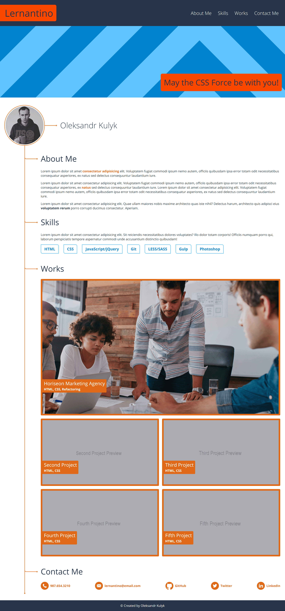
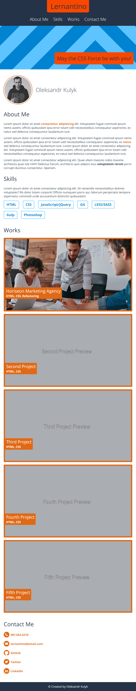
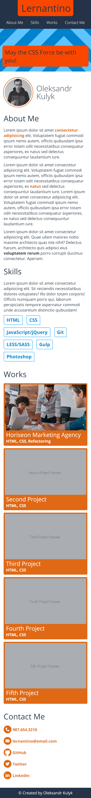

# Portfolio Landing Page Example

**Author: _Oleksandr Kulyk_**

**Preview link** - https://alexkuwerz.github.io/unh-portfolio-landing-page/src/index

## Description

Portfolio landing page example includes Header sections with Logo and main menu, Content section, that divided into Hero banner and About Me, Skills, Works, Contact Me blocks, Footer section. By clicking on the menu items, the page will be scrolled to the corresponding block with content. Works block contain project examples which on click navigate to original project page. Web page is fully responsive on all screen sizes.

## Technologies

HTML, CSS.

## Preview Images

* **Desktop View** - At size 992px and above:

* **Tablet View** - At size 768px and above:

* **Mobile View** - At size less than 768px:

